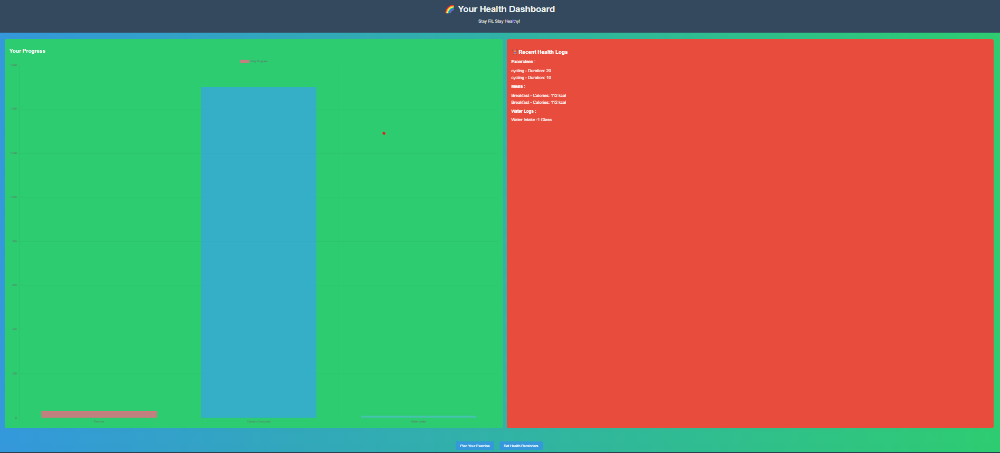
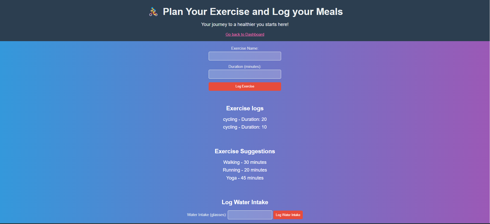
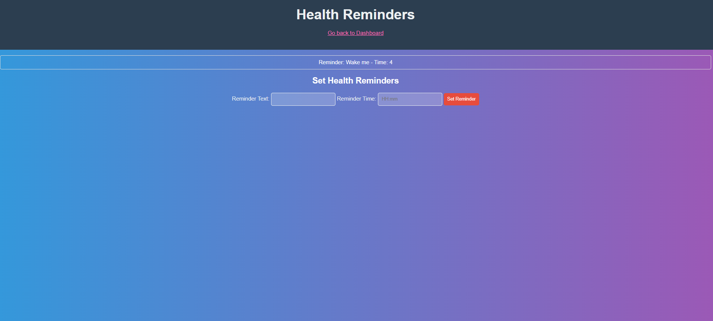

# Health Manager

This health web application is created for people to improve their health and fitness and to live a long and healthy life. User's can set their various goals and also log in various things like excercises which they complete and meals they take to check the no. of calories and they consume and also they can log how many glasses of water they intake. By this users can daily monitor their daily routines of excercises and meals. Users can also set reminders for their various day to day chores using this web application.  \
It is built using NodeJs, ExpressJs, MongoDB, EJS and JavaScript.




## ⚙️ Functionality

### Excercise Planner

- Plan any Excercise with its duration.


### Water Intake Log

- Log water intake(glasses).


### Meal Log

- Log Meal Type and Calorie values.


### Goal Tracker

- Create and track your goals.


### Health Reminders

- Set reminders for your activities.

## 🧑‍💻 Getting started

- Fork the project
- Clone the forked repository in your local system
- Create .env file in the root directory and add the following:-
  - PORT="Your port number"
  - MONGODB_URL="Your MongoDB URL"
- Install all required packages

```bash
npm install
```

- Run project

```bash
npm start or nodemon index.js
```

The project is running on the port number provided by you.

## 🛠️ Tools Used

- NodeJS
- MongoDB
- ExpressJS
- EJS
- Bootstrap

### 📚 Libraries:


- ejs
- express
- mongoose


## 🖼️ Screenshots




